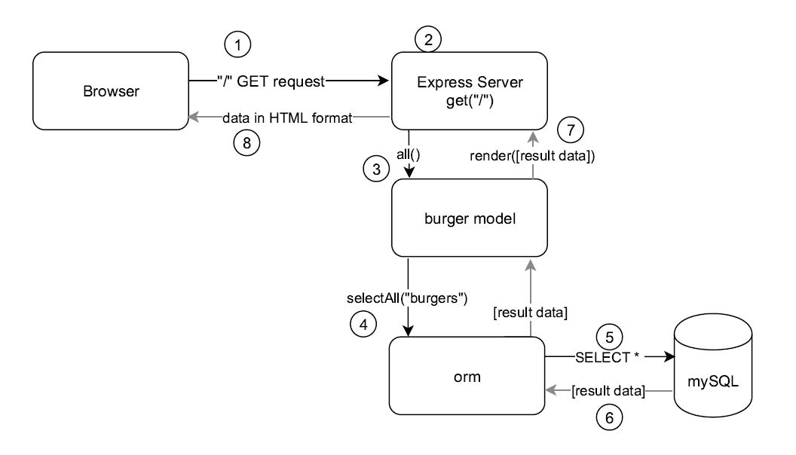

**Eat-Da-Burger!**

UCF Bootcamp Week 14 Homework.

Handlebars JS and ORM


# Contents

 * [Overview](#overview)

 * [How To Run](#howToRun)
 
 * [File Structure](#FileStructure)
 
 * [Technologies Used](#techsUsed)
 
  * [Support](#support)
 
 
### Overview <a name="overview"></a>
"eat-da-burger" is a simple web app to showcase using the *handlebars* view templating engine and object-relational-modeling (ORM). 
The user enters a burger name in a text field in the page and adds it to a list of burgers to be devoured. Clicking the "Eat it" button moves the burger to the "devoured burgers" list.  Another button allows the user to clear the list of all devoured burgers.  Data persistence is provided by a MySQL relational database in the back end. 


### How To Run <a name="howToRun"></a>
The application has been deployed to Heroku and is accessible [here](https://ancient-shore-99109.herokuapp.com/)

A demo video can be accessed [here]https://engjoserobles-gmail.tinytake.com/tt/Mzc3NTgzOV8xMTUxMzE1MQ


### File Structure <a name="FileStructure"></a>
```
+ burger
|   .gitignore : Files ignored by git
|   package-lock.json : Created by npm
|   package.json : Application package file. 
|   README.md : this file
|   server.js : Express httpd server logic.
|   
+---config
|       connection.js : mySQL Database configuration.
|       orm.js : Object-Relational-Modeling logic.
|       
+---controllers
|       burgerController.js : Controller logic (The "C" in MVC). 
|       
+---db
|       schema.sql : Database and table definitions.
|       seeds.sql  : Initial table data. 
|       
+---models
|       burger.js : Business Object model (The burger). 
|       
+---node_modules : Dependencies installed by npm
|           
+---public
|   \---assets
|       +---css
|       |       style.css : CSS Styling
|       |       
|       \---js
|               burgers.js : Front end logic
|               
\---views
    |   index.handlebars : HTML/Handlebars View
    |   
    +---layouts
    |       main.handlebars : Top HTML/Handlevars view. 
    |       
    \---partials
        \---burgers
                burger-block.handlebars : Handlebars partial view. 
                

```

### Technologies Used <a name="techsUsed"></a>

Eat-Da-Burger is more complex than previous works.  The full stack is used now following the MVC architectural model. 

The view uses HTML, javaScript and Handlebars (front end templating engine).

The Controller is pure javaScript logic using the Express npm module.

The Model is implemented using javaScript objects and a custom set of functions in javaScript as the Object-Relational-Mapping (ORM).

Data persistence for the model is provided by a mySQL database. 

The following diagram shows the interaction of the application's components during processing of the initial GET method ("/" URL in the browser): 



1) The browser makes a GET request to the listening port of the Express server (endpoint of the ```listen()``` method in Express), requesting the root document "/".

2) The Express server executes the ```get()``` method in an Express ```Router()``` object (controller code), handling the "/" route.

3) The ```get()``` method calls the ```all()``` method in the "burger" object model, in turn, this calls the ```selectAll()``` method from the ORM (4) . 

5) ```selectAll()``` in the ORM calls the ```query()``` method to run the SELECT statement against the mySQL database, fetching all the records from the ```burgers_db.burger``` table. 

6) The result data is returned to the ORM's ```selectAll()``` method and the ```all()``` method in the model, and eventually the ```render()``` method in the controller code is called (7) , which generates the HTML via the *handlebars* view engine, and  sends it back to the browser (8). 

### Support <a name="support"></a>
  If you have any issues using the app, send me a notification at [engjoserobles@gmail.com](mailto:engjoserobles@gmail.com)
  
